# KA-CHING 
## A mobile game application that enables children to gain financial literacy, without all the jargon and nitty-gritty
## DubHacks 2020 Submission

### Inspiration
Financial literacy can greatly improve a family’s economic situation. Community work has shown that by teaching financial literacy to low-income families, they can have the opportunities to succeed in life. Most methods of educating financial literacy involve financial terms and banking, making it difficult for kids to understand and have an urge to learn. We thought this approach provides a more realistic view of how money-spending is in real life and also provides kids to learn in a fun way.

### What it does
It's a mobile app for both Android and iOS that introduces children to the concept of money, saving, and budgeting, builds skills of evaluating competing priorities and trade-offs and shifts screen time from unproductive tasks to productive learnings. Users make quick decisions based on how much they earn and see the results in a fun and engaging game. We created a website ka-ching.tech where students can play the game online to further expand the reach of the game and make it able for all students. We hope to expand KA-CHING so that it reaches other people through our website and registered domain: [ka-ching.tech](https://ka-ching.tech/). <- try it out!

### How we built it
The UI was designed in Figma and then Flutter and Dart were used for the front end and back end implementations. Flutter allowed us to create a beautiful and efficient app in a very short amount of time, something we needed because of time constraints. We registered our website’s domain with domain.com and are hosting it in the cloud with Google Firebase. Firebase not only hosts our static site for visitors wanting to learn more about our product, it also hosts a demo of our Android app running natively in the browser. 

### Challenges we ran into
* Trying to understand how to use Dart
* Setting up the project environment
* Trying to work across time zones and countries, with people we just met 
* Trying to accomplish everything in such a short period of time

### Accomplishments that I'm proud of
* Learning a new coding language for Flutter, Dart. 
* Being able to work with new people in an online environment 
* Creating a product in only 24 hours!

### What we learned
* How to use Dart, Flutter and Figma
* How to communicate more efficiently and effectively
* How to have fun with it!

### What's next for KA-CHING
We hope to implement additional features such as more job and city options.
We also want to have a page that gives a breakdown of how the user performed, allowing kids to understand where they make most of their money choices (such as for entertainment, for hanging out with friends, and etc.) and how much money they were willing to spend based on the expenses they’ve already spent and the payments they’ve received for that month.

### Screenshots

  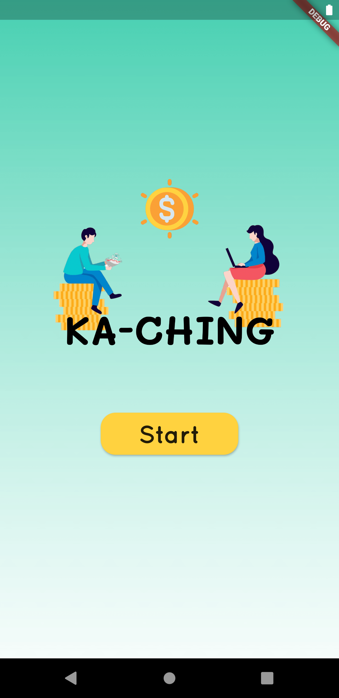
  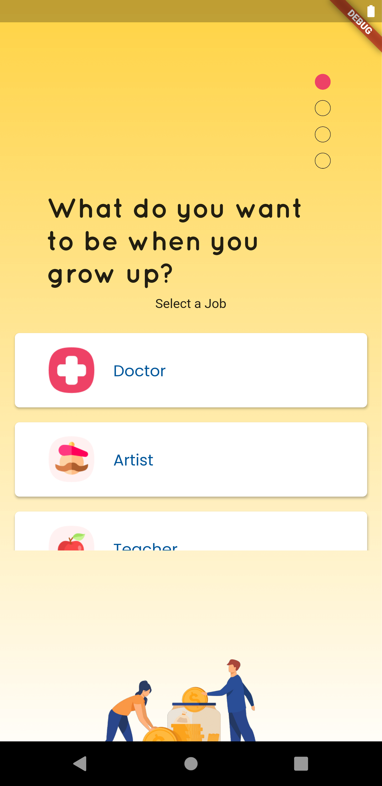
  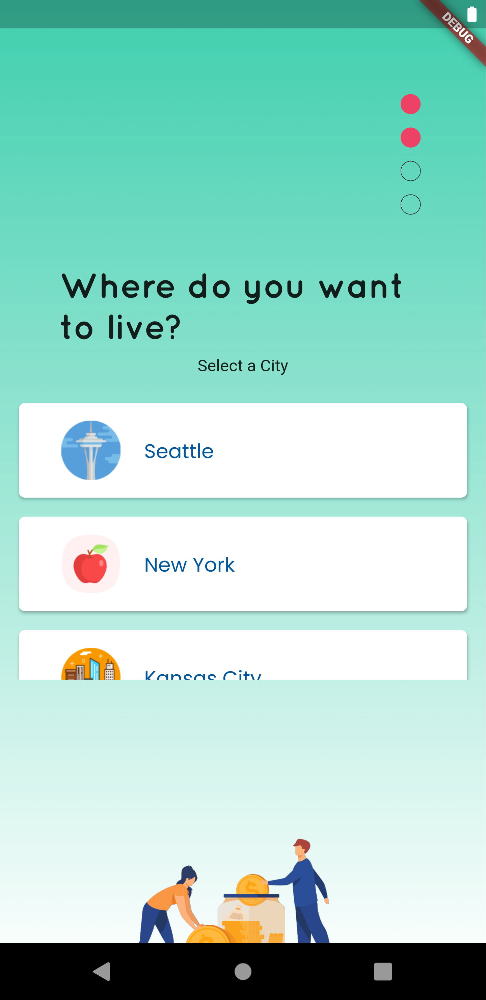
  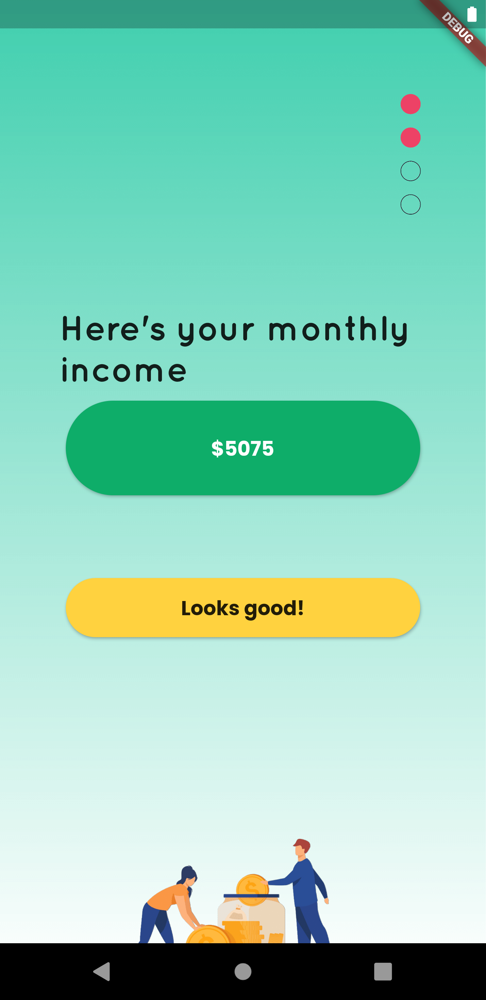
  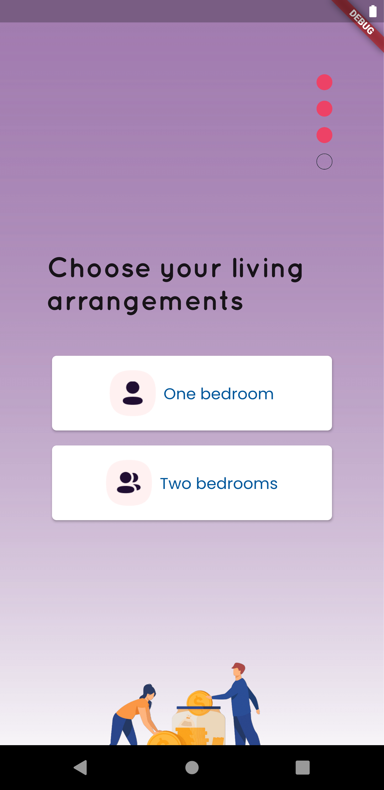
  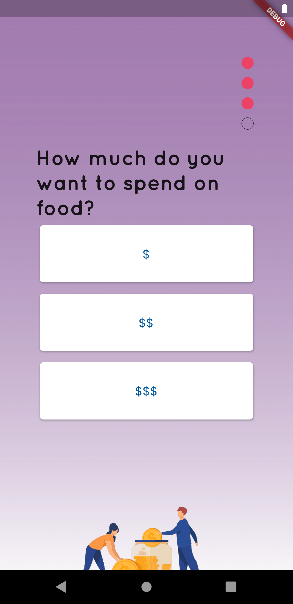
  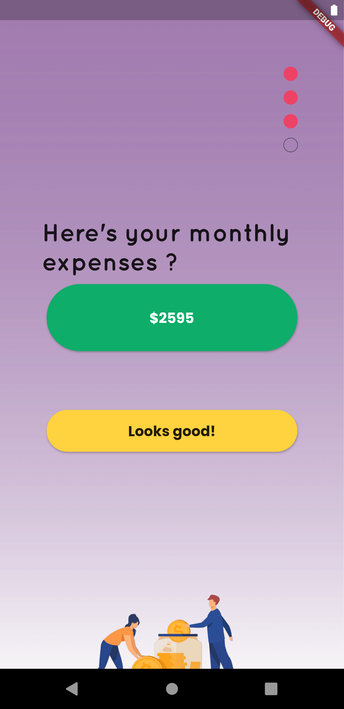
  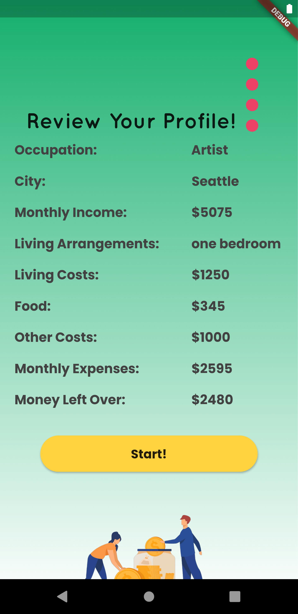
  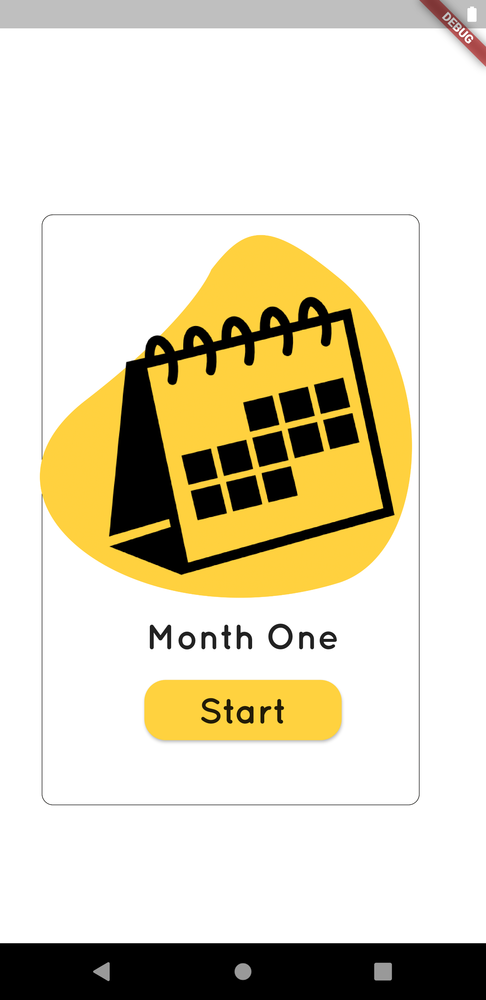
  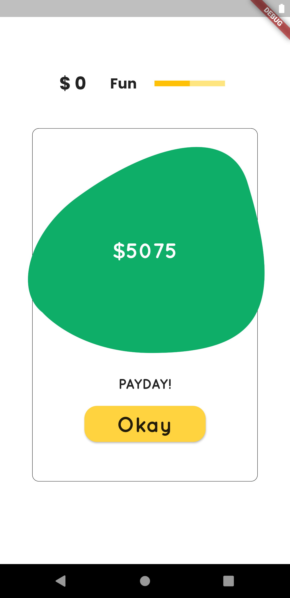
  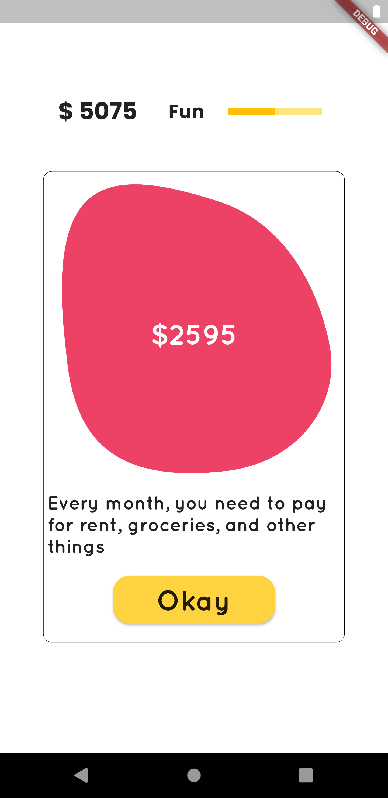
  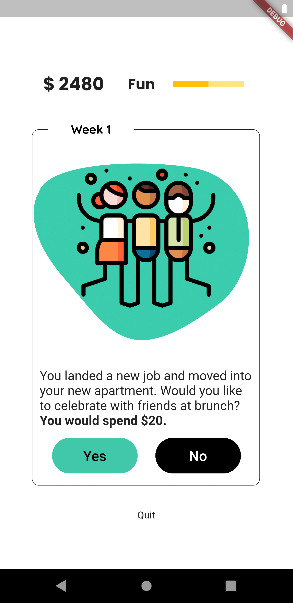
  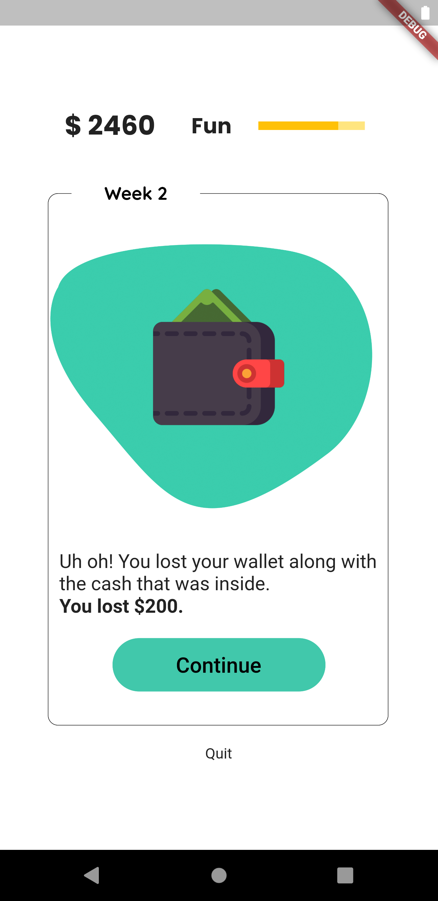
  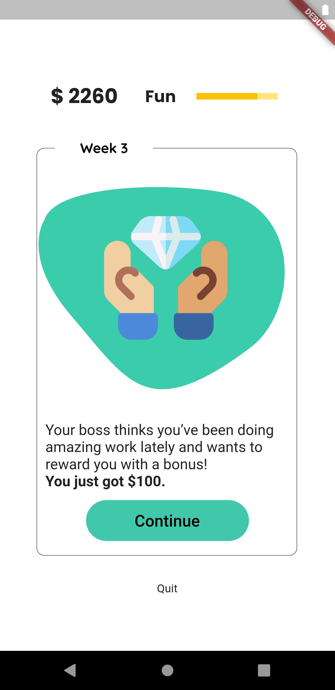
  
  
  
  
  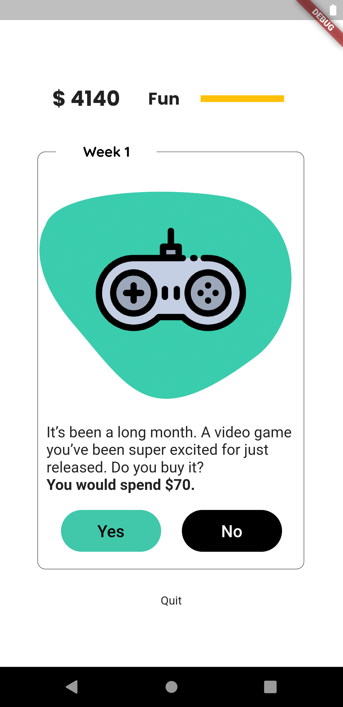
  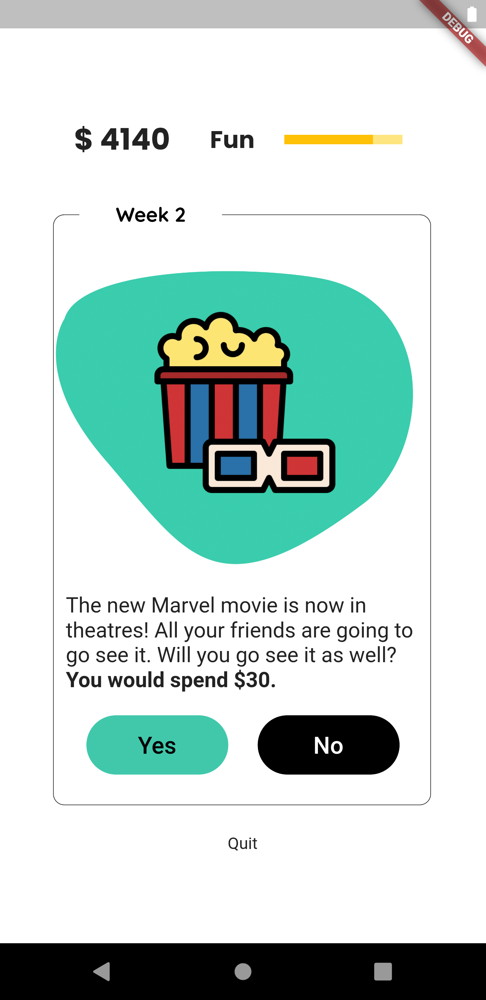
  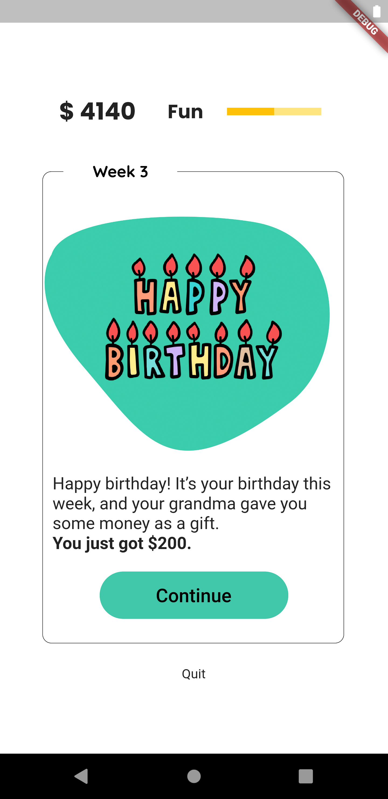
  
  
  
  
  
  
  
  

